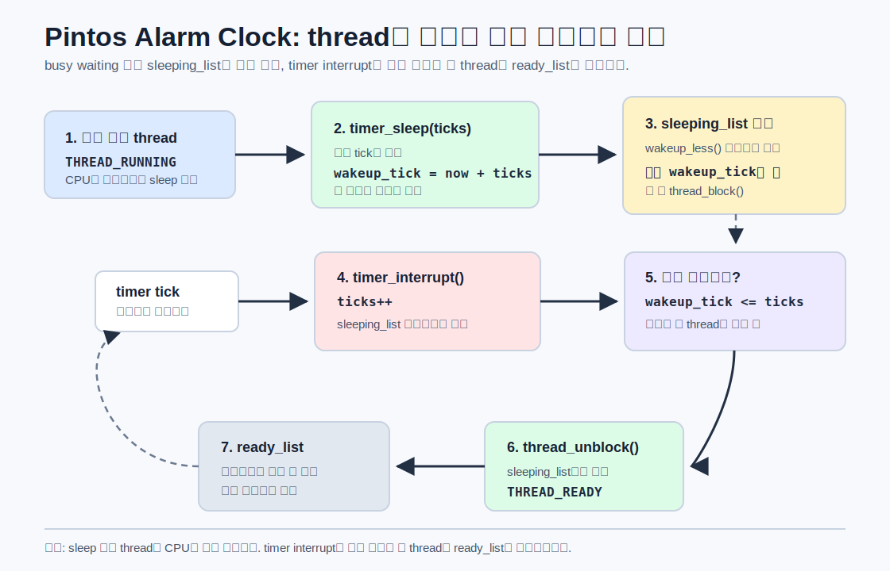
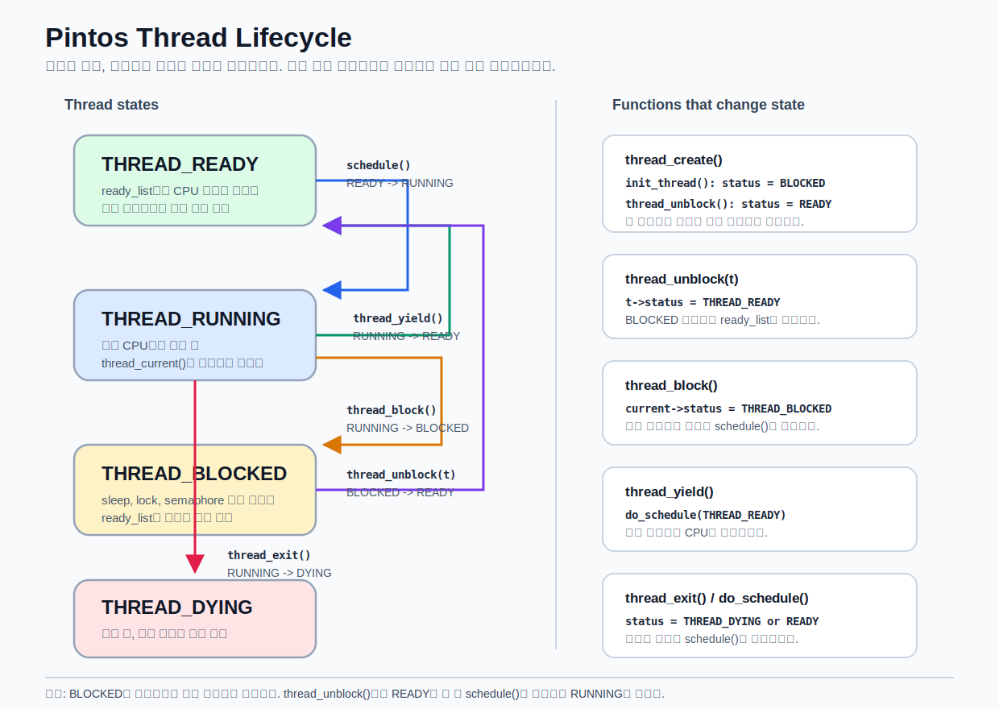

# Alarm Clock Flow

Pintos alarm clock은 `timer_sleep()`을 호출한 스레드를 바쁜 대기(busy waiting)로 계속 돌리지 않고, 깨워야 할 tick까지 `sleeping_list`에 재워 두었다가 timer interrupt에서 다시 `ready_list`로 보내는 구조입니다.



## 핵심 흐름

1. 스레드가 `timer_sleep(ticks)`를 호출합니다.
2. 현재 tick을 읽고 `wakeup_tick = now + ticks`를 계산합니다.
3. 현재 스레드를 `sleeping_list`에 `wakeup_tick` 기준으로 정렬해서 넣습니다.
4. `thread_block()`으로 현재 스레드를 `THREAD_BLOCKED` 상태로 바꿉니다.
5. 매 timer interrupt마다 전역 `ticks`가 증가합니다.
6. `sleeping_list`의 앞쪽부터 `wakeup_tick <= ticks`인 스레드를 꺼냅니다.
7. 꺼낸 스레드를 `thread_unblock()`으로 `ready_list`에 넣고 `THREAD_READY` 상태로 바꿉니다.
8. 스케줄러가 해당 스레드를 고르면 다시 실행됩니다.

## 관련 코드 위치

| 역할 | 위치 |
| --- | --- |
| 잠자는 스레드 목록 | `devices/timer.c`의 `sleeping_list` |
| 잠들 tick 저장 | `include/threads/thread.h`의 `struct thread.wakeup_tick` |
| sleep 요청 처리 | `devices/timer.c`의 `timer_sleep()` |
| wake-up 정렬 기준 | `devices/timer.c`의 `wakeup_less()` |
| tick마다 깨우기 | `devices/timer.c`의 `timer_interrupt()` |
| 스레드를 block 상태로 전환 | `threads/thread.c`의 `thread_block()` |
| 스레드를 ready 상태로 전환 | `threads/thread.c`의 `thread_unblock()` |

## 상태 변화

```text
RUNNING
  |
  | timer_sleep()
  v
BLOCKED  -- sleeping_list에서 wakeup_tick까지 대기
  |
  | timer_interrupt()가 thread_unblock()
  v
READY
  |
  | scheduler 선택
  v
RUNNING
```

## 왜 sleeping_list를 정렬하나

`sleeping_list`를 `wakeup_tick` 오름차순으로 유지하면 timer interrupt에서 리스트 전체를 매번 뒤질 필요가 없습니다. 맨 앞 스레드가 아직 깰 시간이 아니면, 그 뒤 스레드들은 더 늦게 깰 스레드들이므로 바로 중단할 수 있습니다.

```c
if (t->wakeup_tick > ticks)
    break;
```

이 구조 덕분에 alarm clock은 CPU를 낭비하는 busy waiting 대신, 필요한 tick이 올 때까지 스레드를 확실히 재워둘 수 있습니다.

---

# Thread Lifecycle Flow

Pintos 스레드는 `THREAD_RUNNING`, `THREAD_READY`, `THREAD_BLOCKED`, `THREAD_DYING` 상태를 오갑니다. 상태는 단순히 enum 값만 바뀌는 것이 아니라, `ready_list`에 들어가거나 빠지고, 스케줄러가 다음 실행 대상을 고르는 흐름과 함께 바뀝니다.



## 스레드 상태

| 상태 | 의미 |
| --- | --- |
| `THREAD_RUNNING` | 지금 CPU에서 실행 중인 스레드입니다. |
| `THREAD_READY` | 실행할 준비가 끝났고 `ready_list`에서 CPU 차례를 기다리는 상태입니다. |
| `THREAD_BLOCKED` | sleep, semaphore, lock 등을 기다리느라 아직 실행할 수 없는 상태입니다. |
| `THREAD_DYING` | 종료 중인 상태입니다. 스케줄이 넘어간 뒤 실제 메모리 정리가 진행됩니다. |

## 상태를 바꾸는 주요 함수

<table>
  <thead>
    <tr>
      <th>함수</th>
      <th style="min-width: 180px;">상태 변화</th>
      <th>함수 내용</th>
    </tr>
  </thead>
  <tbody>
    <tr>
      <td><code>thread_create()</code></td>
      <td><code>BLOCKED->READY</code></td>
      <td><code>palloc_get_page()</code>로 스레드 구조체를 만들고, <code>init_thread()</code>로 기본 상태를 <code>THREAD_BLOCKED</code>로 초기화합니다. 그 뒤 처음 실행할 함수 정보를 <code>intr_frame</code>에 세팅하고 <code>thread_unblock()</code>으로 <code>ready_list</code>에 넣습니다.</td>
    </tr>
    <tr>
      <td><code>thread_unblock(t)</code></td>
      <td><code>BLOCKED->READY</code></td>
      <td>blocked 상태의 스레드 <code>t</code>를 실행 가능한 상태로 바꾸고 <code>ready_list</code>에 넣습니다. 이때부터 스케줄링 대상이 됩니다.</td>
    </tr>
    <tr>
      <td><code>thread_block()</code></td>
      <td><code>RUNNING->BLOCKED</code></td>
      <td>현재 실행 중인 스레드를 blocked 상태로 바꾸고 <code>schedule()</code>을 호출해서 다른 스레드에게 CPU를 넘깁니다.</td>
    </tr>
    <tr>
      <td><code>thread_yield()</code></td>
      <td><code>RUNNING->READY</code></td>
      <td>현재 스레드가 CPU를 자발적으로 양보합니다. idle 스레드가 아니라면 현재 스레드를 다시 <code>ready_list</code>에 넣고 <code>do_schedule(THREAD_READY)</code>를 호출합니다.</td>
    </tr>
    <tr>
      <td><code>thread_exit()</code></td>
      <td><code>RUNNING->DYING</code></td>
      <td>현재 스레드를 종료 상태로 만들고 다시는 돌아오지 않습니다. 내부에서 <code>do_schedule(THREAD_DYING)</code>을 호출합니다.</td>
    </tr>
    <tr>
      <td><code>do_schedule(status)</code></td>
      <td><code>RUNNING->status</code></td>
      <td>현재 스레드의 상태를 인자로 받은 <code>status</code>로 바꾼 뒤 <code>schedule()</code>을 호출합니다.</td>
    </tr>
    <tr>
      <td><code>schedule()</code></td>
      <td><code>READY->RUNNING</code></td>
      <td><code>next_thread_to_run()</code>으로 <code>ready_list</code>에서 다음 스레드를 고르고, 그 스레드의 상태를 <code>THREAD_RUNNING</code>으로 바꾼 뒤 실제 context switch를 진행합니다.</td>
    </tr>
  </tbody>
</table>

## 핵심 흐름

```text
thread_create()
  -> init_thread()로 새 스레드를 BLOCKED 상태로 준비
  -> thread_unblock()으로 READY 상태가 되어 ready_list에 들어감
  -> schedule()이 선택하면 RUNNING

RUNNING 상태에서:
  -> thread_yield() 호출 시 READY로 돌아감
  -> thread_block() 호출 시 BLOCKED로 잠듦
  -> thread_exit() 호출 시 DYING으로 종료됨

BLOCKED 상태에서:
  -> thread_unblock()이 호출되어야 READY가 됨
  -> READY가 된 뒤에야 schedule()의 선택 대상이 됨
```
