수정해야할 파일
- threads/thread.*
- threads/synch.*

```C
lock
struct lock {
	struct thread *holder;  // Thread holding lock
	struct semaphore semaphore; // Binary semaphore controlling access
}
```
```C
semaphore
struct semaphore {
	unsigned value;             /* Current value. */
	struct list waiters;        /* List of waiting threads. */
};
```
sema_init
- sema를 주어진 초기값을 가지는 새로운 세마포어로 초기화한다.
sema_down
- sema에 대해 down 연산 또는 P 연산을 수행한다.
- 세마포어 값이 0이면 현재 스레드는 기다리고, 값이 1 이상이 되면 값을 하나 줄이고 계속 실행한다.
sema_try_down
- sema에 대해 down 연산 또는 P 연산을 시도한다.
- 하지만 sema_down()과 달리 기다리지 않는다.
- 세마포어 값을 성공적으로 감소시켰으면 true를 반환한다.
- 반대로 세마포어 값이 이미 0이라서 기다리지 않고는 감소시킬 수 없는 상태라면 false를 반환한다.
- 이 함수를 빠르게 반복문 안에서 계속 호출하면 CPU 시간을 낭비하게 된다. 따라서 그런 방식 대신 sema_down()을 사용하거나 다른 접근 방식을 찾아야 한다.

sema_up
- sema에 대해 up 연산 또는 V 연산을 수행한다.
- 세마포어 값을 1 증가시킨다.
- 만약 sema를 기다리고 있는 스레드들이 있다면, 그중 하나를 깨운다.
- 대부분의 동기화 도구들과 달리, sema_up()은 외부 인터럽트 핸들러 안에서도 호출될 수 있다.
- 세마포어는 내부적으로 인터럽트 비활성화와 스레드의 블록 및 언블록을 이용하여 구현되어 있다.
- 여기서 스레드 블록과 언블록은 다음 함수들을 말한다.


priority
- 0(PRI_MIN)~63(PRI_MAX)값, 31이 기본값
- 높은 값이 먼저 실행
- 내림차순으로 해야함
- priority scheduling를 위해 핀토스 스케쥴러를 바꿔야 한다.
- priority scheduling을 위한 PintOS 바꿔야할 조건
- struct thread의 priority에 의한 ready_list 정렬
- 동기화 primitive(세마포어, 조건 변수)를 위한 wait list 정렬
- preemption 시행
- preemption point : 쓰레드가 ready_list에 들어갈 때 (timer interrupt가 불려질때만, 모든 경우에서 안해도 됨)
- 운영체제는 preemption을 오직 ready list를 다룰때만 함

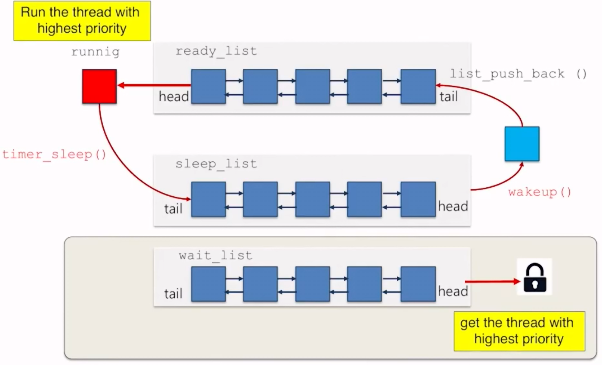

- ready list에서 다음에 돌릴걸 검사하면 가장 높은 우선순위의 스레드를 얻는다.
- wating_list에서 쓰레드가 lock을 기다릴 때, 락이 이용 가능할 때 운영체제는 가장 높은 priority를 선택

3가지를 먼저 고려 해봐야 하는데
- read_list에서 스레드 하나 고를 때 우리는 가장 높은 priority로 골라야함
- 현재 running중인 스레드보다 높은 priority를 가진 스레드가 새로 insert 할 때
- 조정 가능한 스레드를 기다린다 뭘 위해 synchronization primitive(lock: semaphores, condition variable)
- 락을 기다리는 스레드(condition variable이거나)들 중 스레드를 선택할 때 가장 높은 우선순위로 고름

수정해야할 함수

thread_create
- point
  - 우리는 priority 기준으로 정렬된 ready_list를 갖고 싶다
  - 만들어진 thread에 넣을때 너는 스레드를 priority로 정렬된 순서로 넣을 것이다.
  - 근데 이건 무겁다
  - ready_list에 넣을 때 운영체제는 현재 스레드와 새롭게 들어온 스레드의 priority를 비교할거다
  - 새롭게 들어온 스레드의 priority가 더 높으면 schedule을 실행할 거다. 그러면 새롭게 들어온 CPU가 실행될 거다.

schedule
- current_thread를 꺼내고 THREAD_RUNNING인지 확인하고 list_pop_front, ready_list에서 가장 앞에 있는 걸 가지고 와서 THREAD_RUNNING 시킴
- -> ready_list의 순서를 내림차순으로 정렬해야함
- thread_unblock (t) 이후로 현재 스레드와 새로 넣는 스레드와 priority를 비교해야함
- 만약 새로운 스레드가 priority가 더 높으면 현재 스레드로 RUNNING해야함

thread_unblock
- unblock하면 priority 내림차순으로 ready_list에 넣음
- 그래서 priority로 정렬하는데 내림차순으로 정렬

```C
thread_unblock (struct thread *t) {
	enum intr_level old_level;

	ASSERT (is_thread (t));

	old_level = intr_disable ();
	ASSERT (t->status == THREAD_BLOCKED);
	// list_push_back (&ready_list, &t->elem);
	list_insert_order(&ready_list, &t->elem, cmp_priority, NULL);
	t->status = THREAD_READY;
	intr_set_level (old_level);
}
```

thread_yield
- 양보하면 priority 내림차순으로 current_thread를 넣음

thread_set_priority
- 현재 pintos는 현재 스레드의 값만 바꿈
- 현재 스레드 priority를 바꿈
- ready_list 재정렬도 해야함
- 이유는 리스트의 스레드에 맞춰서 순서를 바꿔야함
- FIFO로 lock을 결정

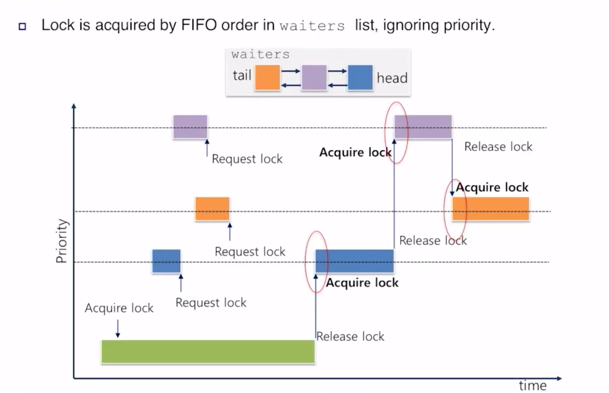
- 그래프에 4개의 스레드 존재
- 밑에서 위로 A,B,C,D라 지칭
- A가 현재 holding lock이고 Release lock 직전까지 유지
- 이후 B,D,C 순서로 요청
- B, D 사이에 priority inversion 발생
- 높은 priority가 낮은 priority를 기다림
- 핀토스는 five lock unlock 매커니즘 때문에 기다림

sema_init
- 주어진 value로 semaphore를 시작

sema_down
- 해당하는 semaphore의 값을 1 낮춰서 semaphore를 요청, 수정 필요

sema up
- 해당하는 semaphore의 값을 1 올려서 release semaphore, 수정 필요

struct lock {
	struct thread *holder;  // Thread holding lock
	struct semaphore semaphore; // Binary semaphore controlling access
}

우선순위에 의한 lock_primitive로 수정하기 위해서 semaphore를 충분히 수정해야함

struct condition {
	struct list waiters; // list of waiting threads
}

cond_init
- condition_variable data struct 시작

cond_wait
- block-state로 만들고 condition variable에 의한 신호를 기다림, 가장 높은 priority의 신호를 기다림

cond_signal
- 대기 중인 condition_variable에 가장 높은 priority의 신호를 보냄

cond_broadcase
- condition_variable에 대기중인 모든 스레드에 신호를 보냄

수정해야할 함수

들어가는 thread를 waiters에 순서대로 넣어야함
- sema_down
- cond_wait

priority 순으로 waiter를  sort
waiters 안에 스레드의 priority가 변하는 경우를 고려해야함
- sema_up
- cond_signal

lock_init
- lock 데이터 구조를 시작

lock_acquire
- lock을 요청

lock_release
- release lock

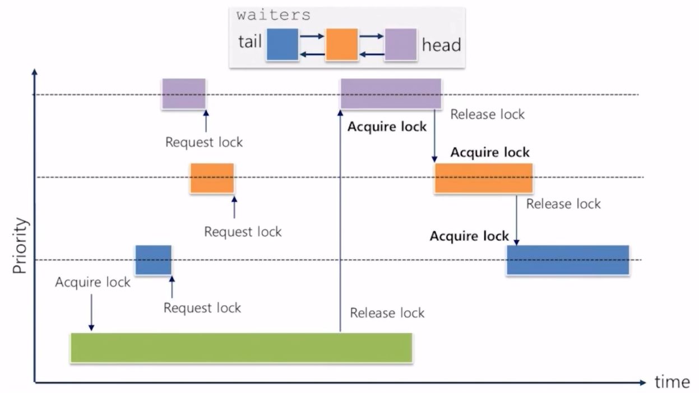

priority inversion

밑에서부터 A,B,C 쓰레드가 존재할 때

C가 lock을 요청하지만 A가 들고 있어 A가 running, C가 block

이때 A보다 prioirty가 높고 C보다 낮은 B가 acquired lock 요청

A를 기다린다고 C가 block

이때 CPU를 B에게 넘김 왜냐하면 priority가 A보다 커서

B와 C의 관계가 중요한데 C 는 B보다 priority가 높지만 B가 끝날 때 까지 기다림

이걸 priority inversion이라고 함

이걸 우리가 고쳐야함

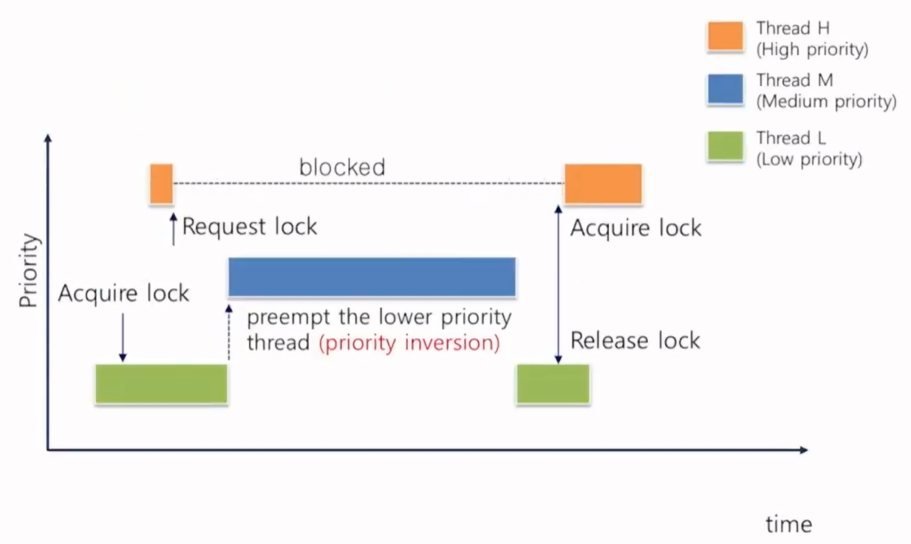

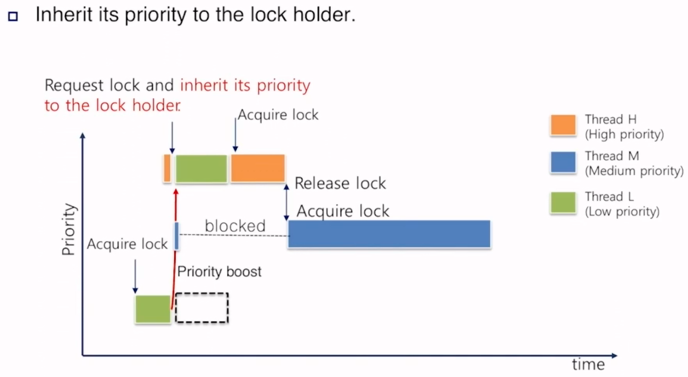

priority donation은 프로세스의 priority를 lock holder에게 상속하는 걸 의미

ABC가 밑에서 부터 존재

A가 락을 잡고 있는 동안 실행

A는 실행, C는 락을 요청

lock은 A가 들고 있음

A가 낮은 priority를 들고 있음

C가 lock을 요청하고 a가 lock을 들고 있으면 C는 A에게 우선순위를 상속,

A는 C의 레벨으로 priority가 오름

A의 priority 레벨은 C로 오르고 B가 시스템에 도착

B는 A보다 크지만 C보다 작아서 선점할 이유가 없음

A는 C의 레벨로 작동, A가 끝나면 C를 작동, 끝나고 lock을 풀고 B에게 전달

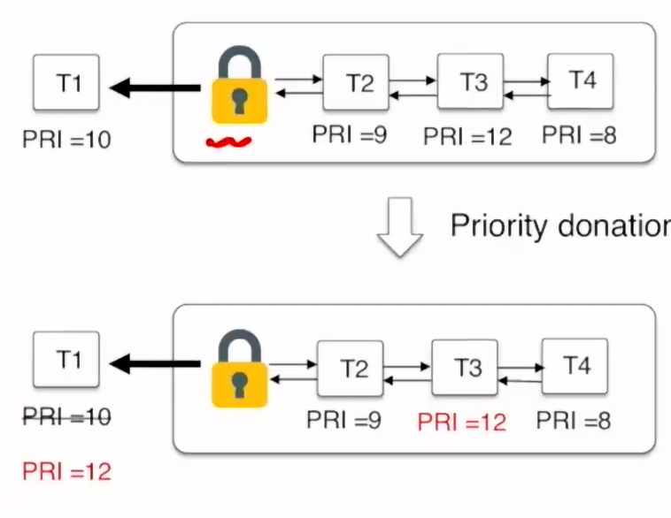

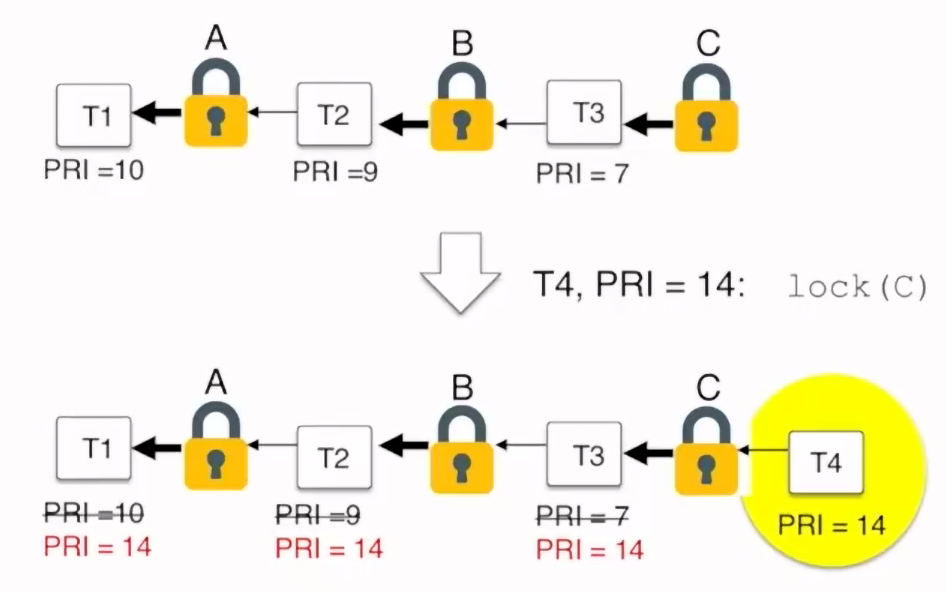

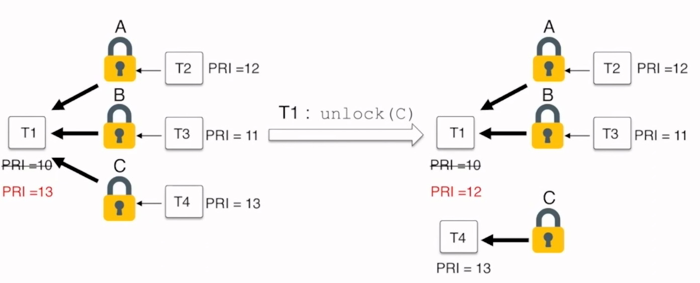

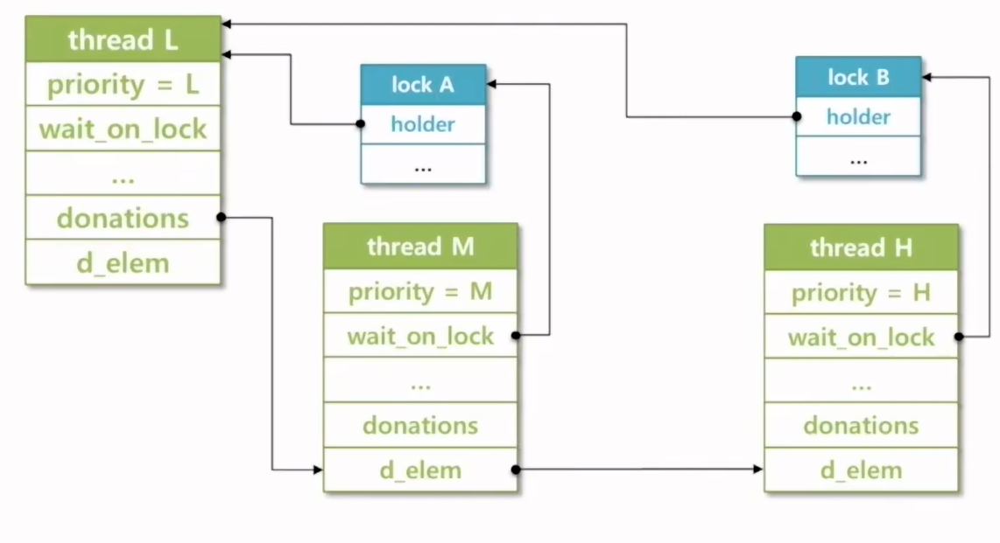

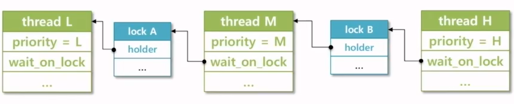

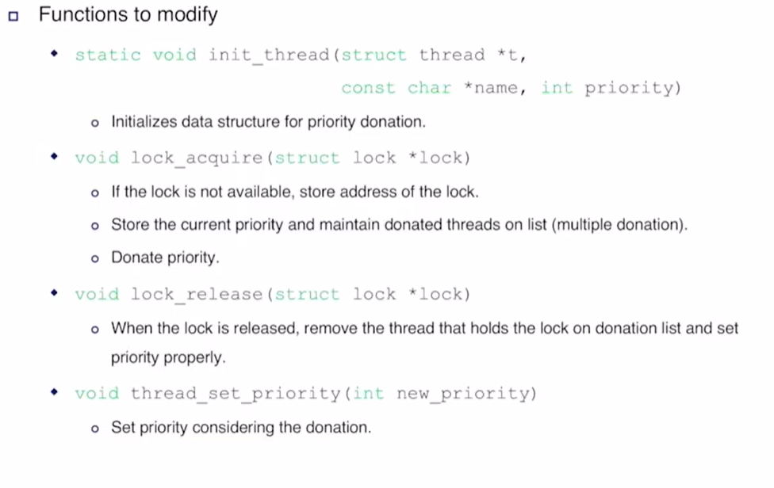

현재 thread = cur

cur가 lock_acquire(lock)을 호출함

그런데 lock->holder가 이미 있음

=> lock is not available

=> cur는 block될 예정

lock이 비활성화 되면 lock의 주소를 저장

현재 priority를 저장하고 리스트에 donated 된 스레드를 지속한다 (multiple donation)

Donate priority

lock이 풀리면 donation list에 lock을 들고있고 priority를 적절히 조정하는 스레드를 제거

thread_set_priority

donation 할 priority 설정